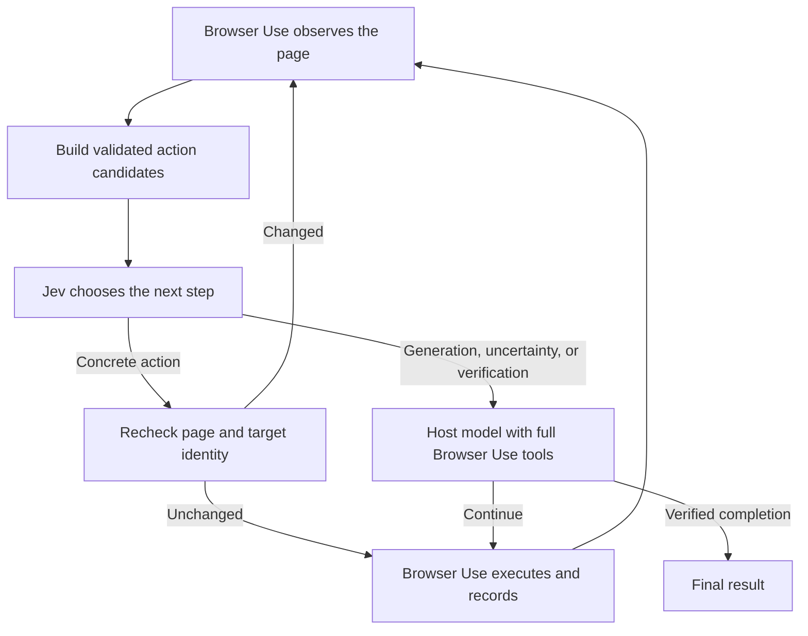

# Browser Use with Jev

[](https://github.com/ZiyaoLi/browser-use-with-jev/actions/workflows/ci.yml)

**Use Jev in the Codex sidebar or with Browser Use's execution engine.**

Browser Use with Jev lets [TypeSafe Jev](https://docs.typesafe.ai/introduction)
choose from concrete browser actions while a host handles generation, recovery,
and final verification. In Codex desktop it defaults to the visible in-app browser.
The Python SDK and standalone mode retain the installed
[Browser Use](https://github.com/browser-use/browser-use) engine without patching it.

| Mode | Browser execution | Host |
| --- | --- | --- |
| Codex sidebar (desktop default) | Codex Computer Use, with bundled JavaScript helper | Current conversation |
| Standalone Browser Use | Upstream Python Browser Use, separate browser | Current conversation bridge or configured API model |

The sidebar helper adapts the community `jev-browser-use` implementation and is
bundled here; you do not need that other skill installed. It does not run the
Python Browser Use engine inside the panel. See the
[sidebar workflow](skills/browser-use-with-jev/references/sidebar.md) and
[attribution](skills/browser-use-with-jev/THIRD_PARTY_NOTICES.md).

**Status: early alpha.** Offline integration tests pass. The current-conversation
bridge and sidebar backend have been exercised on a local browser form; broad
site coverage and comparative performance benchmarks are still pending. Moving most
routine decisions to Jev is the goal, not a measured claim about this release.

See the [live bridge verification](docs/bridge-verification.md) for the tested
workflow, observed results, and limits. The sidebar has its own
[verification record](docs/sidebar-verification.md).

This is an independent project, not an official Browser Use or TypeSafe product.

## Motivation and related projects

I built this independent implementation after exploring
[Browser Use's Jev Ultrafast](https://github.com/browser-use/jev-ultrafast).
Its dynamic, indexed action space motivated the split here: let Jev choose among
concrete actions and let a general-purpose model handle generation and judgment.
My goal is to retain upstream Browser Use capabilities while moving most routine
decisions to Jev, with the current Codex conversation available as the host.

| Project | Relationship to this implementation |
| --- | --- |
| [browser-use/jev-ultrafast](https://github.com/browser-use/jev-ultrafast) | Browser Use's own Jev experiment and the primary motivation; a standalone agent with a small text-generation model |
| [browser-use/browser-use](https://github.com/browser-use/browser-use) | The actual execution dependency here: browser sessions, tools, history, and agent loop |
| [wy-coliney/jev-browser-use](https://github.com/wy-coliney/jev-browser-use) | Community Skill whose CUA helper is adapted into our bundled sidebar backend |

The Python backend implements its own routing and current-conversation bridge
on top of Browser Use. The sidebar adapts the community helper under its MIT
license. Neither related project is an installed runtime dependency. This is
not the official Ultrafast Skill; published speed claims for other projects are
not benchmarks for this one.

## Use in Codex desktop

Follow the steps below—or simply send [this repository URL](https://github.com/ZiyaoLi/browser-use-with-jev) to your Codex and ask it to install and configure the Skill for you.

**The active Codex conversation can serve as the host model. No additional
OpenAI or other text-model API key is required for this mode.** Jev still needs
its configured provider credential. The sidebar runs actions through Codex's
Computer Use tools; the standalone bridge connects the assistant's tool loop to
Python Browser Use. Neither exposes your Codex login as an API.

### 1. Install the checkout and Skill

Use a local Codex desktop project with shell access. Install Git,
[uv](https://docs.astral.sh/uv/getting-started/installation/), Python 3.11+, and a
Chrome/Chromium browser supported by Browser Use for standalone mode. Sidebar
mode needs Codex Computer Use and Node.js 22+ for local tests/the optional API
worker; it does not need the Python runtime installed to operate. These workflows
have been exercised on macOS; other platforms have not been verified end to end.

Run in a terminal, or ask Codex to run these commands:

```bash
git clone https://github.com/ZiyaoLi/browser-use-with-jev.git
cd browser-use-with-jev
uv sync --locked
python3 scripts/install_skill.py
python3 skills/browser-use-with-jev/scripts/doctor.py --mode sidebar
python3 skills/browser-use-with-jev/scripts/doctor.py --mode standalone
```

Keep this checkout on disk and open it as a local project in Codex for setup.
The installer creates a live link at `~/.codex/skills/browser-use-with-jev`
(or `$CODEX_HOME/skills/browser-use-with-jev`). It preserves conflicting existing
installations. Install the full checkout: copying only the Skill directory omits
the Python runtime used by standalone mode. Sidebar mode requires the host's Computer
Use runtime. The standalone bridge does not require that runtime or a custom MCP server.

### 2. Configure Jev once

If your existing key file is `~/.jev.env`, run from the checkout:

```bash
uv run python -m browser_use_with_jev.bridge configure --jev-env ~/.jev.env
```

Substitute your actual file path. The file may contain a single raw key or a
dotenv entry named `TYPESAFE_API_KEY`. Only its path is saved in
`~/.config/browser-use-with-jev/config.json`; the credential is not copied into
the Skill. You do not need to create the API-host `.env` shown later in this README.

### 3. Give Codex a browser task

Start a new local task and explicitly mention the Skill:

```text
Use $browser-use-with-jev in the visible Codex sidebar.
Open https://example.com and report its title. Verify it from the page.
```

Codex opens its sidebar browser, lets Jev select bounded actions, and handles
text input and final verification in the conversation. It retains the result tab
for you. Existing Jev configuration is reused. If the CUA runtime cannot reach
the API, an optional locally authorized Node worker handles only Jev requests.
You do not need to run workers or write model replies yourself.

For DNS failures, the [sidebar troubleshooting workflow](skills/browser-use-with-jev/references/sidebar.md#optional-local-api-worker)
uses `node skills/browser-use-with-jev/sidebar-check.mjs` with normally approved
network access before launching the worker. This makes one synthetic API request;
it does not send browser content or count as a completed browser action.

For the original independent browser, say **“Use $browser-use-with-jev in
standalone Browser Use mode with this conversation as host.”** Codex then uses
the Python request/respond bridge. Browser profiles do not automatically inherit
your usual Chrome logins. Keep the task active until completion in either mode.

Sidebar mode supports clicks, toggles, scrolling, safe keys, back/reload and input
handoffs. Complex widgets, uploads and extraction stay with Codex. It does not
inherit Python Browser Use's tool registry, memory compression or hierarchical
candidate router. Oversized candidate pools/context hand back to Codex.

The setup above can also be requested in plain language:

```text
Install https://github.com/ZiyaoLi/browser-use-with-jev as a live local Skill.
Follow its README, use my existing Jev key file at ~/.jev.env, and preserve
existing configuration. Use the current Codex conversation as the host.
Then open https://example.com and verify its title with $browser-use-with-jev.
```

### Updates and troubleshooting

To update an unmodified checkout, run `git pull --ff-only` and `uv sync --locked`
from its directory. For local development, edit that same checkout. Skill changes
are available on subsequent loads; restart running workers to load Python changes.

| Symptom | Next step |
| --- | --- |
| Skill is missing | Start a new task or restart Codex; verify the checkout still exists and rerun the doctor |
| Your Codex version uses `~/.agents/skills` | Install with `python3 scripts/install_skill.py --skills-dir ~/.agents/skills`; avoid duplicate copies in multiple discovery paths |
| Missing dependency or interpreter | Run `uv sync --locked` in the checkout and rerun the doctor |
| Asked for a host API key | Explicitly request the current-conversation bridge with `$browser-use-with-jev`; `OPENAI_API_KEY` is unnecessary in that mode |
| Browser fails to launch | Check upstream browser setup and local execution permissions; on macOS, run workers outside the Codex seatbelt sandbox to avoid upstream AppKit aborts |

See [OpenAI's Skill documentation](https://learn.chatgpt.com/docs/build-skills)
for discovery and invocation, and our
[bridge workflow](skills/browser-use-with-jev/references/current-conversation.md)
for the implementation. The doctor checks installation only; a successful live
browser task is a separate check.

## How it works

The diagram below describes the Python backend. Sidebar mode keeps its mechanical
loop in CUA and hands input/verification directly to the conversation.



| Responsibility | Current implementation |
| --- | --- |
| Clicks, checkbox/radio controls | Jev selects observed indexed targets |
| Page/container scrolling, back, wait, tab switching | Jev selects code-built parameters |
| Text input | Jev can select a field; the host generates and enters text |
| Dropdowns | Jev can request options; host selects by default, extensible with candidates |
| Planning, extraction, uploads, files, visual reasoning | Original Browser Use host/tool path |
| Custom tools | Original registry remains available; bounded candidates can extend Jev routing |
| Completion | Jev requests verification; the host makes the final assessment |

The original run loop, browser session, tool execution, history, and completion
machinery remain upstream-owned. This preserves those code paths; it is not a
claim that every upstream feature has been tested end to end in hybrid mode.

## Standalone quick start with an API host

For desktop Codex using the current conversation, follow
[Use in Codex desktop](#use-in-codex-desktop) above instead.

Requires Python 3.11+, [uv](https://docs.astral.sh/uv/), a TypeSafe API key,
and a Browser Use-compatible host model. The dependency is pinned to
`browser-use==0.13.10` because the adapter uses one protected upstream hook.

```bash
git clone https://github.com/ZiyaoLi/browser-use-with-jev.git
cd browser-use-with-jev
uv sync --locked
cp .env.example .env
```

Fill `TYPESAFE_API_KEY` and `OPENAI_API_KEY` in your local `.env`. For an
OpenAI-compatible host provider, use its key, model ID, and optional `--base-url`.
Configure the browser using the [upstream setup instructions](https://github.com/browser-use/browser-use#readme).
Then run, replacing `YOUR_HOST_MODEL_ID` with a model you have access to:

```bash
uv run --env-file .env python examples/basic.py \
  --model YOUR_HOST_MODEL_ID \
  "Open https://example.com and report its title."
```

This example makes real model calls and opens a browser. `.env` is ignored by Git.
Use `--jev-env /path/to/credentials` to explicitly load an existing Jev dotenv or
single-line key file. Otherwise, Jev reads `TYPESAFE_API_KEY` from the environment.
It does not discover credential files automatically or modify them.

## Python API

Use your existing Browser Use model and browser configuration:

```python
from browser_use_with_jev import JevAgent, JevClient

agent = JevAgent(
    task="Your browser task",
    llm=your_existing_browser_use_model,
    jev=JevClient.from_env(),
    # browser=your_browser,
    # tools=your_tools,
)
history = await agent.run(max_steps=30)
print(history.final_result())
print(agent.routing)
```

The executable example is [examples/basic.py](examples/basic.py). Upstream
constructor options continue through `JevAgent` to Browser Use.

### Use the embedding agent's own model

`HostModel` adapts an async inference callback. It creates no model API client
and requires no additional API key of its own:

```python
from browser_use_with_jev import HostModel

async def infer_with_host(messages, *, output_format=None, **kwargs):
    return await your_runtime.infer(messages, output_format=output_format)

host = HostModel(infer_with_host)
# Pass llm=host to JevAgent.
```

`your_runtime` must be implemented by the embedding application. Return a dict
or model matching the requested Pydantic `output_format`, or a string when it is
`None`. Messages may include images. The callback supports the same model protocol
used by upstream extraction and verification.

### Run directly inside the current Codex conversation

The local bridge now connects Browser Use host requests to the current assistant's
tool loop. No separate text-model API key is needed. The assistant reads the
request and screenshots, generates the response in this conversation, and submits
it to the waiting worker. There is no hidden Codex API or unattended model service.

After installing the Skill below, configure your existing Jev credential file once:

```bash
uv run python -m browser_use_with_jev.bridge configure --jev-env /path/to/jev.env
```

Only the file path is saved to `~/.config/browser-use-with-jev/config.json`.
Then ask Codex: **“Use $browser-use-with-jev in standalone mode for this browser task.”**
For standalone mode, explicitly request it; the Skill manages the
`start → request → respond → status` loop. It uses a new
isolated browser profile, not the user's already logged-in Chrome tabs. Sessions
require an active assistant tool loop and cannot generate host replies after the
conversation stops. See the [bridge workflow](skills/browser-use-with-jev/references/current-conversation.md).

Advanced command reference:

```bash
uv run python -m browser_use_with_jev.bridge --help
```

Each request includes the actual output schema, so extraction and final judging
are supported alongside action generation. Response IDs prevent duplicate replies;
timeouts and `cancel` stop waiting work. Session directories contain private page
content and screenshots and must stay out of Git. Default browser extensions are
disabled for bridge sessions; `--extensions` enables upstream extension downloads.

## Install the Codex Skill for ongoing development

From this checkout:

```bash
python3 scripts/install_skill.py
python3 skills/browser-use-with-jev/scripts/doctor.py --mode sidebar
python3 skills/browser-use-with-jev/scripts/doctor.py --mode standalone
```

The installer links `~/.codex/skills/browser-use-with-jev` to this checkout
(or uses `$CODEX_HOME/skills`). Invoke **`$browser-use-with-jev`** in a later turn.
Skill edits are picked up when it is loaded again; no reinstall is needed.
Keep the checkout in place. Restart the app if a new skill is not discovered.
Dependencies still need `uv sync --locked` when the lockfile changes, and running
Python processes must restart to load code changes.

The link installer preserves conflicting existing skills. Use `--skills-dir`
for a different installation directory. The skill does not replace the community
`$jev-browser-use`, store credentials, or automatically upgrade dependencies.

### Extend decision coverage

Pass `candidate_provider(page, action_model)` to offer extra `Candidate(label,
action)` objects, including finite parameter combinations for registered custom
tools. Derive parameters from observed state or host-prepared data. The adapter
validates each candidate against the active upstream schema; Jev selects a choice
ID rather than generating arguments or executable code. Completion always stays
with the host.

`allow_candidate(candidate)` narrows Jev delegation. It does not restrict host
actions and is not a global authorization boundary. Use upstream tool and browser
configuration for application-wide restrictions.

## Routing controls and observability

| Option | Default | Effect |
| --- | --- | --- |
| `min_confidence` | `0.65` | Lower confidence hands back to the host |
| `max_candidates` | `128` | Maximum choices per question, including HOST/VERIFY; larger pools use operation/target groups |
| `max_context_chars` | `40000` | Larger complete request bodies (including candidates) hand back |
| `host_every` | `12` | Periodic host review after consecutive Jev selections |
| `jev_on_error` | `"handoff"` | Record an API failure and use the host; `"raise"` disables this |

Small candidate pools use a single choice question. Larger pools select an operation
and compatible targets in one speculative request. Only the selected operation's
target answer and confidence are consumed. Oversized target pools use exhaustive
groups and subsequent target questions; no candidate is dropped. Group descriptions
can reference indexed nodes already present in the current DOM/context, while final
action choices retain their full labels. Long leaf labels trigger further grouping.
If a combined request exceeds the context budget, targets are deferred until the
operation is known. Each complete request must still fit the budget or hand off.
The effective choice ceiling is `min(max_candidates, 255)`, including handoffs;
limits below four cannot route oversized pools. An oversized operation vocabulary
also hands off. This follows the provider's [Choice limit](https://docs.typesafe.ai/api).

Before another target request and before returning an action, the adapter compares
fresh page text, indexed DOM
node identities, tabs, and scroll state. A stale choice returns no action; the
upstream failure/step machinery handles re-observation. Dynamic pages can consume
the upstream failure budget. Confidence thresholds are heuristics, not calibrated
success guarantees. The browser can still change after the recheck.

`agent.routing` records Jev requests, selected actions, host decision calls,
handoff reasons, errors, stale choices, and Jev latency. **Selected is not
executed:** use upstream history for actual outcomes. Auxiliary host calls such
as extraction, compaction, and judging are not included in `routing.host_calls`;
these counters alone do not measure total model cost. A multi-question API request
counts once; recursive selection can make multiple requests for one browser action.

Jev context v2 sends the current upstream state message once, preserving task
constraints, history/compacted memory, todo, plan, read-once results and page state.
It removes the exact default Browser Use system prompt and the adapter's duplicate
task/DOM/history fields. Custom system extensions/overrides and additional messages
remain intact; full messages and screenshots still go to the host on handoff.
Calls without an upstream state message use a typed-state fallback. History
compaction stays upstream-owned. The 40,000-character default applies to both the
SDK and bridge and includes candidates and selection instructions; over-budget
requests hand off without truncation.

Bridge sessions persist per-round `decisions/*.json`, including the actual candidate
count/list, whether a Jev request was made, selected choice, confidence, probability
distribution, model, latency, and handoff reason. Decisions also include
`request`, the latest proposed JSON body without credentials, `request_submitted`,
plus input/context/request
character counts and context source mode. These counts are not token counts. Explicit HOST/VERIFY selections
retain their own reason even below the confidence threshold. SDK users can pass
`decision_sink(record)` to persist the same records. Traces contain private page
labels and action parameters; keep them with the private session, outside Git.
The `requests` list preserves every stage's body, choice counts, submission flag,
answers/probabilities and latency; `selection_path` records the consumed route.
`candidate_count` still counts the complete pool, not just the selected group.
Candidates exclude hidden/inert branches, duplicate target identities, frame-shell
clicks and pure scroll-container clicks. Distinct visible frames are preserved even
when their labels or URLs match; identical-looking calendars may represent different
state. See [routing verification](docs/routing-verification.md) for offline coverage
and replay measurements; these are not live-site success or model-quality results.

Use `bridge wait --session-dir PATH --wait 30`, and `bridge respond ... --wait 30`,
to receive the next request without separate status/read round trips. Requests
record expiry, response submission and completion times, and measured `wait_ms`;
`bridge status` reports pending age and aggregate `host_wait_ms`. This measures
host reply latency separately from Jev inference; it cannot accelerate the host's
own reasoning. Expired or cancelled requests reject replies.

On macOS, this integration refuses browser imports inside Codex's seatbelt sandbox
before upstream AppKit display detection can abort Python. Start workers and run
integration tests with normal desktop permissions outside that sandbox. Headless
mode does not bypass upstream import-time display detection. Lightweight queue
commands and the installation doctor still run inside the sandbox.

Jev receives task/context text, DOM observations, and recent results, not
screenshots. The host can receive screenshots through Browser Use. Upstream
telemetry and browser settings still apply. No real credentials are included in
this repository; tests disable telemetry and use fake API/browser responses.

## Development

```bash
uv sync --locked
uv run ruff check src tests examples scripts skills
uv run ruff format --check src tests examples scripts skills
uv run pytest -q
node --test tests/sidebar.test.mjs tests/sidebar-worker.test.mjs
uv build
```

The offline suite covers real upstream action schemas, custom tool registration
and execution, host fallback, invalid Jev responses, stale targets, context limits,
and credential handling. No paid API or live browser is used. On macOS, upstream
display detection at import time may require running outside a restrictive sandbox.

## Roadmap

- Real-browser fixtures covering input, dropdowns, pagination, uploads and recovery.
- Broader real-site validation and recovery coverage for the current-conversation bridge.
- More observed-parameter candidates, especially dropdown selections.
- Matched upstream-only versus hybrid benchmarks: success, decision share,
  latency, all model calls, tokens, and cost.

See [architecture notes](docs/architecture.md) for the integration boundary.
Contributions should keep browser execution upstream-owned, add regression tests
for behavior changes, and distinguish simulated tests from real-browser evidence.
Please report issues with Python/Browser Use versions and a minimal reproduction,
without credentials or private page data.

## License

MIT License. See [LICENSE](LICENSE). Dependencies retain their own licenses.
