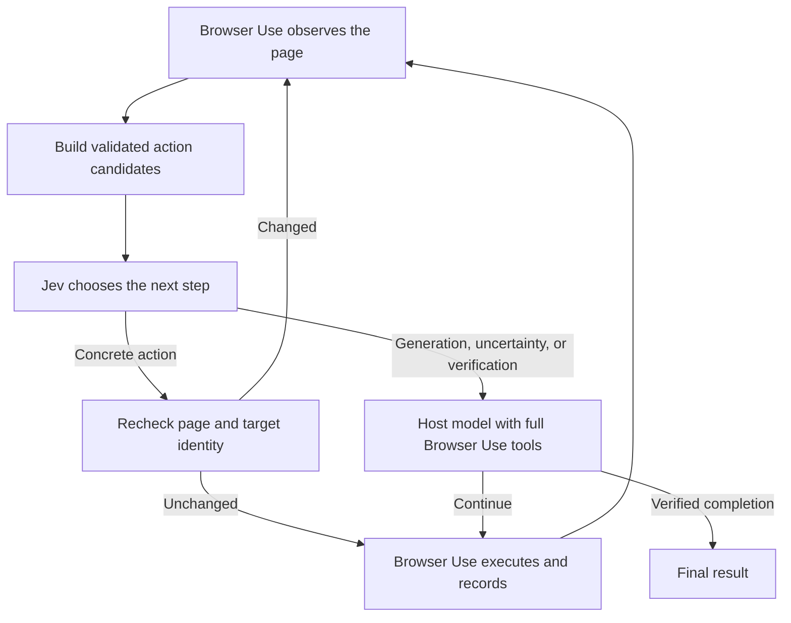

# Browser Use with Jev

[](https://github.com/ZiyaoLi/browser-use-with-jev/actions/workflows/ci.yml)

**Keep Browser Use's execution engine. Move bounded decisions to Jev.**

Browser Use with Jev is a Python integration that lets [TypeSafe Jev](https://docs.typesafe.ai/introduction)
choose from concrete browser actions while a host model handles generation,
complex tools, recovery, and final verification. [Browser Use](https://github.com/browser-use/browser-use)
is an installed dependency; its source is not vendored or patched.

**Status: early alpha.** Offline integration tests pass. The current-conversation
bridge has been exercised on a local browser form; broad site coverage and
comparative performance benchmarks are still pending. Moving most
routine decisions to Jev is the goal, not a measured claim about this release.

See the [live bridge verification](docs/bridge-verification.md) for the tested
workflow, observed results, and limits.

This is an independent project, not an official Browser Use or TypeSafe product.
It does not depend on `jev-ultrafast` or the community `jev-browser-use` Skill.

## How it works



| Responsibility | Current implementation |
| --- | --- |
| Clicks, checkbox/radio controls | Jev selects observed indexed targets |
| Page/container scrolling, back, wait, tab switching | Jev selects code-built parameters |
| Text input | Jev can select a field; the host generates and enters text |
| Dropdowns | Jev can request options; host selects by default, extensible with candidates |
| Planning, extraction, uploads, files, visual reasoning | Original Browser Use host/tool path |
| Custom tools | Original registry remains available; bounded candidates can extend Jev routing |
| Completion | Jev requests verification; the host makes the final assessment |

The original run loop, browser session, tool execution, history, and completion
machinery remain upstream-owned. This preserves those code paths; it is not a
claim that every upstream feature has been tested end to end in hybrid mode.

## Quick start

Requires Python 3.11+, [uv](https://docs.astral.sh/uv/), a TypeSafe API key,
and a Browser Use-compatible host model. The dependency is pinned to
`browser-use==0.13.10` because the adapter uses one protected upstream hook.

```bash
git clone https://github.com/ZiyaoLi/browser-use-with-jev.git
cd browser-use-with-jev
uv sync --locked
cp .env.example .env
```

Fill `TYPESAFE_API_KEY` and `OPENAI_API_KEY` in your local `.env`. For an
OpenAI-compatible host provider, use its key, model ID, and optional `--base-url`.
Configure the browser using the [upstream setup instructions](https://github.com/browser-use/browser-use#readme).
Then run, replacing `YOUR_HOST_MODEL_ID` with a model you have access to:

```bash
uv run --env-file .env python examples/basic.py \
  --model YOUR_HOST_MODEL_ID \
  "Open https://example.com and report its title."
```

This example makes real model calls and opens a browser. `.env` is ignored by Git.
Use `--jev-env /path/to/credentials` to explicitly load an existing Jev dotenv or
single-line key file. Otherwise, Jev reads `TYPESAFE_API_KEY` from the environment.
It does not discover credential files automatically or modify them.

## Python API

Use your existing Browser Use model and browser configuration:

```python
from browser_use_with_jev import JevAgent, JevClient

agent = JevAgent(
    task="Your browser task",
    llm=your_existing_browser_use_model,
    jev=JevClient.from_env(),
    # browser=your_browser,
    # tools=your_tools,
)
history = await agent.run(max_steps=30)
print(history.final_result())
print(agent.routing)
```

The executable example is [examples/basic.py](examples/basic.py). Upstream
constructor options continue through `JevAgent` to Browser Use.

### Use the embedding agent's own model

`HostModel` adapts an async inference callback. It creates no model API client
and requires no additional API key of its own:

```python
from browser_use_with_jev import HostModel

async def infer_with_host(messages, *, output_format=None, **kwargs):
    return await your_runtime.infer(messages, output_format=output_format)

host = HostModel(infer_with_host)
# Pass llm=host to JevAgent.
```

`your_runtime` must be implemented by the embedding application. Return a dict
or model matching the requested Pydantic `output_format`, or a string when it is
`None`. Messages may include images. The callback supports the same model protocol
used by upstream extraction and verification.

### Run directly inside the current Codex conversation

The local bridge now connects Browser Use host requests to the current assistant's
tool loop. No separate text-model API key is needed. The assistant reads the
request and screenshots, generates the response in this conversation, and submits
it to the waiting worker. There is no hidden Codex API or unattended model service.

After installing the Skill below, configure your existing Jev credential file once:

```bash
uv run python -m browser_use_with_jev.bridge configure --jev-env /path/to/jev.env
```

Only the file path is saved to `~/.config/browser-use-with-jev/config.json`.
Then ask Codex: **“Use $browser-use-with-jev to complete this browser task.”**
The Skill manages the `start → request → respond → status` loop. It uses a new
isolated browser profile, not the user's already logged-in Chrome tabs. Sessions
require an active assistant tool loop and cannot generate host replies after the
conversation stops. See the [bridge workflow](skills/browser-use-with-jev/references/current-conversation.md).

Advanced command reference:

```bash
uv run python -m browser_use_with_jev.bridge --help
```

Each request includes the actual output schema, so extraction and final judging
are supported alongside action generation. Response IDs prevent duplicate replies;
timeouts and `cancel` stop waiting work. Session directories contain private page
content and screenshots and must stay out of Git. Default browser extensions are
disabled for bridge sessions; `--extensions` enables upstream extension downloads.

## Install the Codex Skill for ongoing development

From this checkout:

```bash
python3 scripts/install_skill.py
python3 skills/browser-use-with-jev/scripts/doctor.py
```

The installer links `~/.codex/skills/browser-use-with-jev` to this checkout
(or uses `$CODEX_HOME/skills`). Invoke **`$browser-use-with-jev`** in a later turn.
Skill edits are picked up when it is loaded again; no reinstall is needed.
Keep the checkout in place. Restart the app if a new skill is not discovered.
Dependencies still need `uv sync --locked` when the lockfile changes, and running
Python processes must restart to load code changes.

The link installer preserves conflicting existing skills. Use `--skills-dir`
for a different installation directory. The skill does not replace the community
`$jev-browser-use`, store credentials, or automatically upgrade dependencies.

### Extend decision coverage

Pass `candidate_provider(page, action_model)` to offer extra `Candidate(label,
action)` objects, including finite parameter combinations for registered custom
tools. Derive parameters from observed state or host-prepared data. The adapter
validates each candidate against the active upstream schema; Jev selects a choice
ID rather than generating arguments or executable code. Completion always stays
with the host.

`allow_candidate(candidate)` narrows Jev delegation. It does not restrict host
actions and is not a global authorization boundary. Use upstream tool and browser
configuration for application-wide restrictions.

## Routing controls and observability

| Option | Default | Effect |
| --- | --- | --- |
| `min_confidence` | `0.65` | Lower confidence hands back to the host |
| `max_candidates` | `128` | Larger candidate sets hand back instead of truncating |
| `max_context_chars` | `40000` | Larger decision contexts hand back |
| `host_every` | `12` | Periodic host review after consecutive Jev selections |
| `jev_on_error` | `"handoff"` | Record an API failure and use the host; `"raise"` disables this |

Before returning an action, the adapter compares fresh page text, indexed DOM
node identities, tabs, and scroll state. A stale choice returns no action; the
upstream failure/step machinery handles re-observation. Dynamic pages can consume
the upstream failure budget. Confidence thresholds are heuristics, not calibrated
success guarantees. The browser can still change after the recheck.

`agent.routing` records Jev requests, selected actions, host decision calls,
handoff reasons, errors, stale choices, and Jev latency. **Selected is not
executed:** use upstream history for actual outcomes. Auxiliary host calls such
as extraction, compaction, and judging are not included in `routing.host_calls`;
these counters alone do not measure total model cost.

Jev receives task/context text, DOM observations, and recent results, not
screenshots. The host can receive screenshots through Browser Use. Upstream
telemetry and browser settings still apply. No real credentials are included in
this repository; tests disable telemetry and use fake API/browser responses.

## Development

```bash
uv sync --locked
uv run ruff check src tests examples scripts skills
uv run ruff format --check src tests examples scripts skills
uv run pytest -q
uv build
```

The offline suite covers real upstream action schemas, custom tool registration
and execution, host fallback, invalid Jev responses, stale targets, context limits,
and credential handling. No paid API or live browser is used. On macOS, upstream
display detection at import time may require running outside a restrictive sandbox.

## Roadmap

- Real-browser fixtures covering input, dropdowns, pagination, uploads and recovery.
- Broader real-site validation and recovery coverage for the current-conversation bridge.
- More observed-parameter candidates, especially dropdown selections.
- Matched upstream-only versus hybrid benchmarks: success, decision share,
  latency, all model calls, tokens, and cost.

See [architecture notes](docs/architecture.md) for the integration boundary.
Contributions should keep browser execution upstream-owned, add regression tests
for behavior changes, and distinguish simulated tests from real-browser evidence.
Please report issues with Python/Browser Use versions and a minimal reproduction,
without credentials or private page data.

## License

MIT License. See [LICENSE](LICENSE). Dependencies retain their own licenses.
